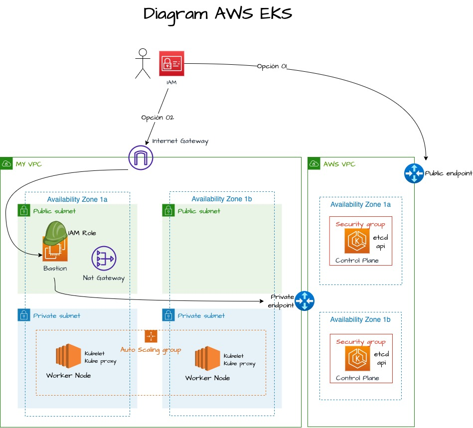

# EKS

## Description

- Este yaml crea dos Stack.
  - Crea la infraestructura como (VPC, NatGateway, 2SubnetsPublicas, 2SubnetsPrivadas, cluster)
  - Crea los recursos como, NodeGroup, Nodos (Server EC2), Auto Scaling Group, Launch Configuration.

## Pre-requisites

- Kubectl
- eksctl
- awscli | Con priviliegios suficientes para crear la infra y recursos.

## Diagram



## Deploy

1. Desplegar desde Local

```console
$ eksctl create cluster -f cluster-eks.yaml --profile jhoseph
```

2. Crear Bastion Host con IAM Role y siguientes Policys.

    - AmazonSSMManagedInstanceCore
    - AmazonEKSWorkerNodePolicy

- En este BastionHost AmazonLinux viene instalado por default AWSCLI, adicionalmente instalamos.

    - Agregar el SG del BastionHost como source al SG del Cluster
    - Install Kubectl

```console
$ aws eks update-kubeconfig --region us-east-1 --name myk8clusterv2
```

3. Agregar el IAM Role del BastionHost al Configmaps del Cluster de EKS | Esto lo hacemos desde Local

```console
$ eksctl create iamidentitymapping --cluster myk8scluster --region=us-east-1 --arn arn:aws:iam::447951840319:role/Ec2Role4SSM --group system:masters --username adminBastion --profile jhoseph
$ kubectl describe configmap aws-auth -n kube-system #Desde BastionHost
```

- Video creacion mediante EKSCTL -> <https://youtu.be/Qexdh0ROL2E>
- Video creacion meidante Consola con Fargate -> <https://youtu.be/Uv5XMArNKiI>
- More info -> <https://eksctl.io/usage/dry-run/>
